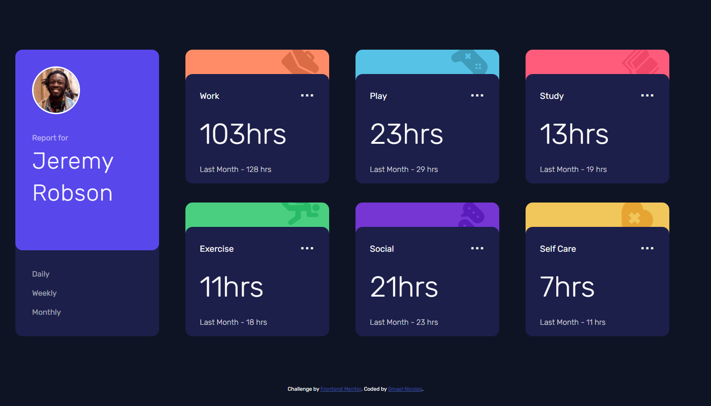
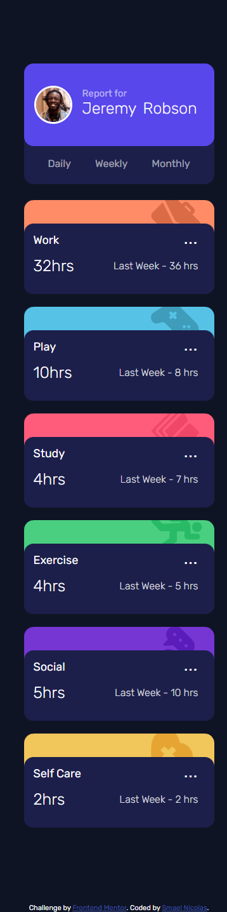

# Frontend Mentor - Time tracking dashboard solution

This is a solution to the [Time tracking dashboard challenge on Frontend Mentor](https://www.frontendmentor.io/challenges/time-tracking-dashboard-UIQ7167Jw). Frontend Mentor challenges help you improve your coding skills by building realistic projects.

## Overview

### The challenge

Users should be able to:

- View the optimal layout for the site depending on their device's screen size
- See hover states for all interactive elements on the page
- Switch between viewing Daily, Weekly, and Monthly stats

### Screenshot

### Links

- Solution URL: [Code](https://github.com/SmaelNicolas/timeTracking)
- Live Site URL: [Web](https://smaelnicolas.github.io/timeTracking/)

## My process

### Built with

- HTML5
- CSS
- SaSS
- Flexbox
- JavaScript

#

## Author

- Website - [Smael Nicolas](https://www.linkedin.com/in/smaeln/)
- Frontend Mentor - [@SmaelNicolas](https://www.frontendmentor.io/profile/SmaelNicolas)
- GitHub - [@SmaelNicolas](https://github.com/SmaelNicolas)
